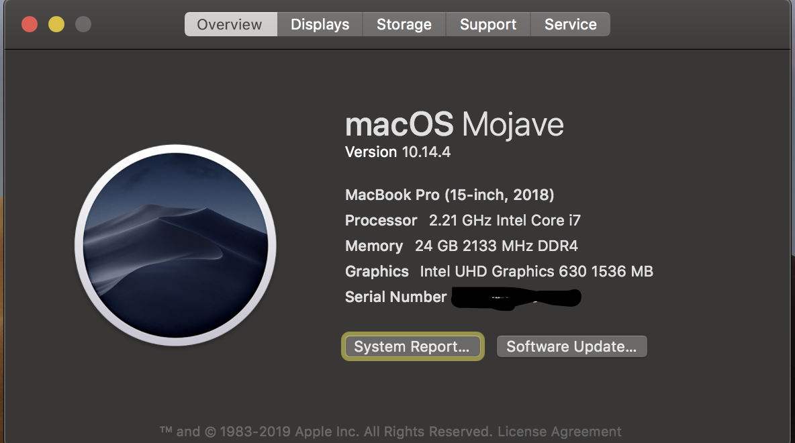

### xps-9570 hackintosh mojave

### preview

### upgrade from 10.14.x
    
- download system update
- use the install_clover to install update, reboot into the system
- replace the EFI folder, rebuild kextcache then reboot

### Device

	uhd display
	8750h
	dw1830
	16GB Ram

use the install clover to install Mac OS Majave(10.14, 10.14.1,  10.14.2, 10.14.3) and boot into the system

then replace the EFI folder, rebuild kextcache and reboot

#### Working

	Intel Graphics accelleration(uhd630)
	wifi & bluetooth (dw1830)
	Audio
	brightlight control
	type-c external display (I use ThinkVersion T24h, it works well, just use the boardid of iMac14,1 Mac-031B6874CF7F642A)
	type-c to hdmi/vga also works
	...

#### Not Working

	hdmi port
	sleep
    ...
	
	
	
ps: 

I have swipe the capslock and left ctrl,
replace a `VoodooPS2Controller.kext` can restore

	

